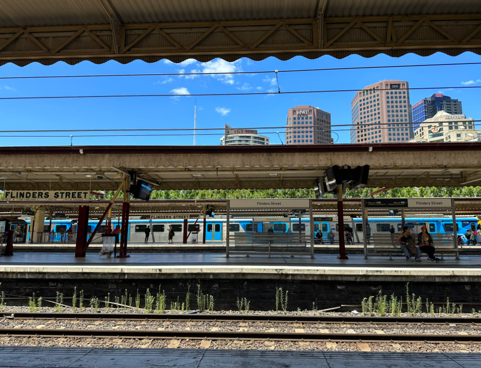

# OSINT Workshop

Google Dorks cheat sheet

| Filter | Description | Example |
| --- | --- | --- |
| allintext | Searches for occurrences of all the keywords given. | `allintext:"keyword"` |
| intext | Searches for the occurrences of keywords all at once or one at a time. | `intext:"keyword"` |
| inurl | Searches for a URL matching one of the keywords. | `inurl:"keyword"` |
| allinurl | Searches for a URL matching all the keywords in the query. | `allinurl:"keyword"` |
| intitle | Searches for occurrences of keywords in title all or one. | `intitle:"keyword"` |
| allintitle | Searches for occurrences of keywords all at a time. | `allintitle:"keyword"` |
| site | Specifically searches that particular site and lists all the results for that site. | `site:"www.google.com"` |
| filetype | Searches for a particular filetype mentioned in the query. | `filetype:"pdf"` |
| link | Searches for external links to pages. | `link:"keyword"` |
| numrange | Used to locate specific numbers in your searches. | `numrange:321-325` |
| before/after | Used to search within a particular date range. | `filetype:pdf & (before:2000-01-01 after:2001-01-01)` |
| allinanchor (and also inanchor) | This shows sites which have the keyterms in links pointing to them, in order of the most links. | `inanchor:rat` |
| allinpostauthor (and also inpostauthor) | Exclusive to blog search, this one picks out blog posts that are written by specific individuals. | `allinpostauthor:"keyword"` |
| related | List web pages that are “similar” to a specified web page. | `related:www.google.com` |
| cache | Shows the version of the web page that Google has in its cache. | `cache:www.google.com` |

Challenge 1:

Can you find where this train station is?

Bonus:

What is the height of the tallest building in this photo?

Challenge 2:

This image seems to show a lot of smoke. Can you find out what is going on?

Bonus:

What are the names of the satellites that took this photo?

[Answers](https://www.notion.so/Answers-e1160dd1bba1402f8e86fba33bd9642e?pvs=21)

Activity 1:

Check the strength of your password in [HaveIBeenPwnd.com](http://HaveIBeenPwnd.com) and [https://www.security.org/how-secure-is-my-password/](https://www.security.org/how-secure-is-my-password/) then consider your online security.

Activity 2:

Quick game of Geoguessr!